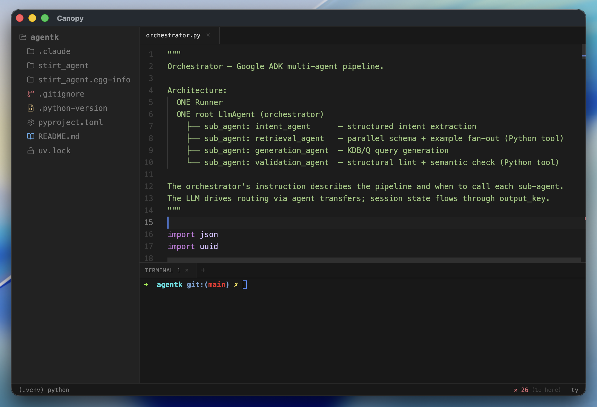
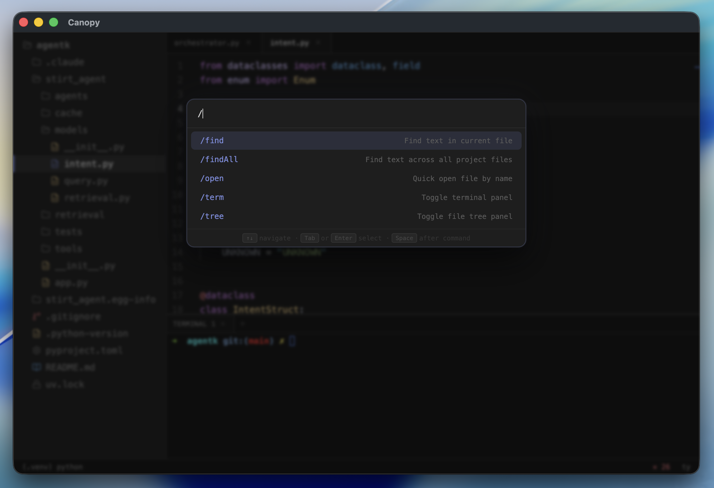
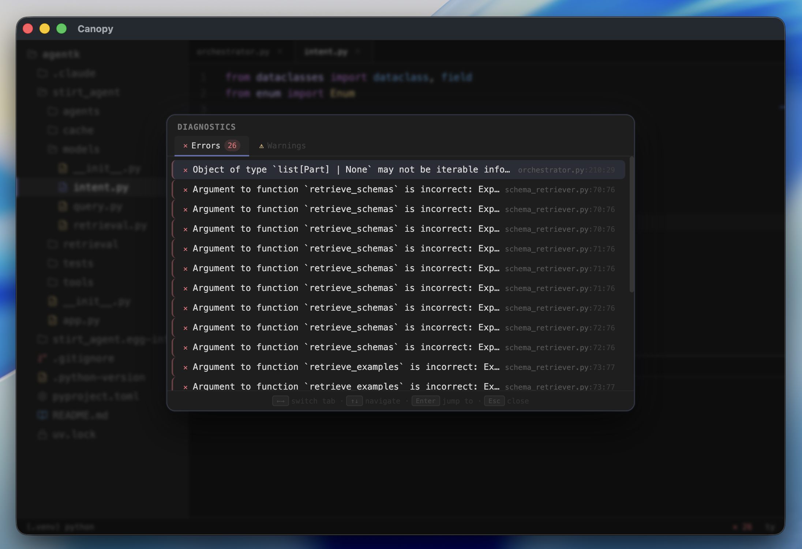

# 🌿 Canopy

**A lightweight, opinionated Python IDE that gets out of your way.**

---

## The Story

I spent years writing Python in VS Code. At first it felt fine — until it didn't.

The extensions marketplace became a graveyard of half-maintained plugins. The IDE started phoning home. Copilot got bolted on everywhere whether I wanted it or not. Pyright was the only real LSP option, baked in so tightly that swapping it out was a fight. And the whole thing kept getting heavier — more telemetry, more nag screens, more things I didn't ask for and couldn't turn off.

I wanted a Python IDE that was **small**, **private**, **fast**, and **honest about what it is**. So I built Canopy.

It's opinionated by design. It won't try to sell you AI features, it won't report your keystrokes anywhere, and it won't bloat itself with an extension ecosystem. It's just a clean, fast editor for people who write Python and want to stay in flow.

---

## What Canopy is

### Lightweight by default

Canopy ships as a single lean binary. There's no extension marketplace, no plugin runtime overhead, no background update daemons. The build pipeline aggressively strips source maps, test files, and type declarations from the bundle. It loads fast and stays fast.

### Zero telemetry. Full stop.

No analytics. No crash reporters phoning home. No event tracking. The only network traffic Canopy generates is the traffic *you* initiate — running your code, fetching packages. The environment variable pipeline is also locked down: only a curated allowlist of safe vars (PATH, HOME, SHELL, PYENV_ROOT, etc.) is forwarded to child processes. Nothing leaks.

### Python first

Canopy was built for one language and it shows. Virtual environment detection is automatic — drop a `.venv` in your project and Canopy picks it up, reads `pyvenv.cfg`, and configures the language server without asking. It watches for new environments appearing mid-session. `pyproject.toml` is a first-class citizen.

### Beautiful, minimal UI

Dark mode. Clean layout. A Zed-inspired syntax theme with purposeful color choices — purples for keywords, greens for strings, cyans for operators, yellows for types. The interface has a file tree, an editor, a terminal, a status bar, and nothing else fighting for your attention.

### Native uv support + ty type checking

Canopy auto-detects [uv](https://github.com/astral-sh/uv) and integrates it natively for environment and dependency management — no configuration needed. For type checking, you can choose between [basedpyright](https://github.com/DetachHead/basedpyright) (battle-tested) and [ty](https://github.com/astral-sh/ty) (Astral's blazing-fast new type checker). Switch between them in one click. Both are supported as first-class LSP adapters with full semantic highlighting, diagnostics, hover types, completions, and go-to-definition.

### AI your way — or not at all

Canopy doesn't bundle Copilot. It doesn't nudge you toward any AI assistant. If you want AI help, you already know where to find it: open the built-in terminal and run [Claude Code](https://claude.ai/code), [Gemini CLI](https://github.com/google-gemini/gemini-cli), [OpenCode](https://github.com/sst/opencode), or whatever you prefer. Your editor and your AI workflow stay decoupled — the way they should be.

---

## Screenshots

*Editor with file tree, integrated terminal, and venv status — clean and nothing else*

*Command palette: find in file, open by name, toggle panels — keyboard-driven*

*Project-wide diagnostics from ty or basedpyright, all in one place*

---

## Features

| | |
|---|---|
| Monaco Editor | Full IntelliSense-grade editing experience |
| Dual LSP support | basedpyright or ty, switchable at runtime |
| Integrated terminal | Full PTY, multiple tabs, your login shell |
| Auto venv detection | Finds `.venv`, `venv`, `.env` automatically |
| Native uv support | First-class environment manager integration |
| Session restore | Remembers open tabs and active file per project |
| File watcher | Detects external changes, prompts to reload |
| Zero telemetry | No analytics, no crash reporters, no phone home |

---

## Installation

Grab the latest release for your platform from the [Releases](../../releases) page.

| Platform | Format |
|---|---|
| macOS | `.dmg` |
| Linux | `.AppImage`, `.deb`, `.rpm` |
| Windows | `.exe` (NSIS) |

---

## Coming Soon

**Agentic development features** — deeper integration with AI coding workflows, directly inside the IDE. Designed the right way: opt-in, composable, and without lock-in.

---

## Built with

- [Electron](https://www.electronjs.org/) — desktop runtime
- [Svelte 5 + SvelteKit](https://svelte.dev/) — UI framework
- [Monaco Editor](https://microsoft.github.io/monaco-editor/) — code editing engine
- [xterm.js](https://xtermjs.org/) — terminal emulation
- [node-pty](https://github.com/microsoft/node-pty) — PTY backend
- [basedpyright](https://github.com/DetachHead/basedpyright) / [ty](https://github.com/astral-sh/ty) — language servers

---

## License

MIT © [Rafael Pierre](https://github.com/rafaelpierre)
